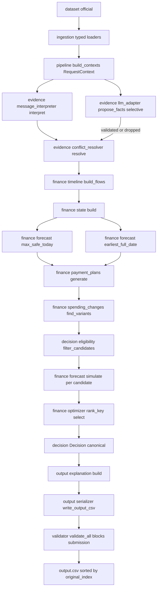
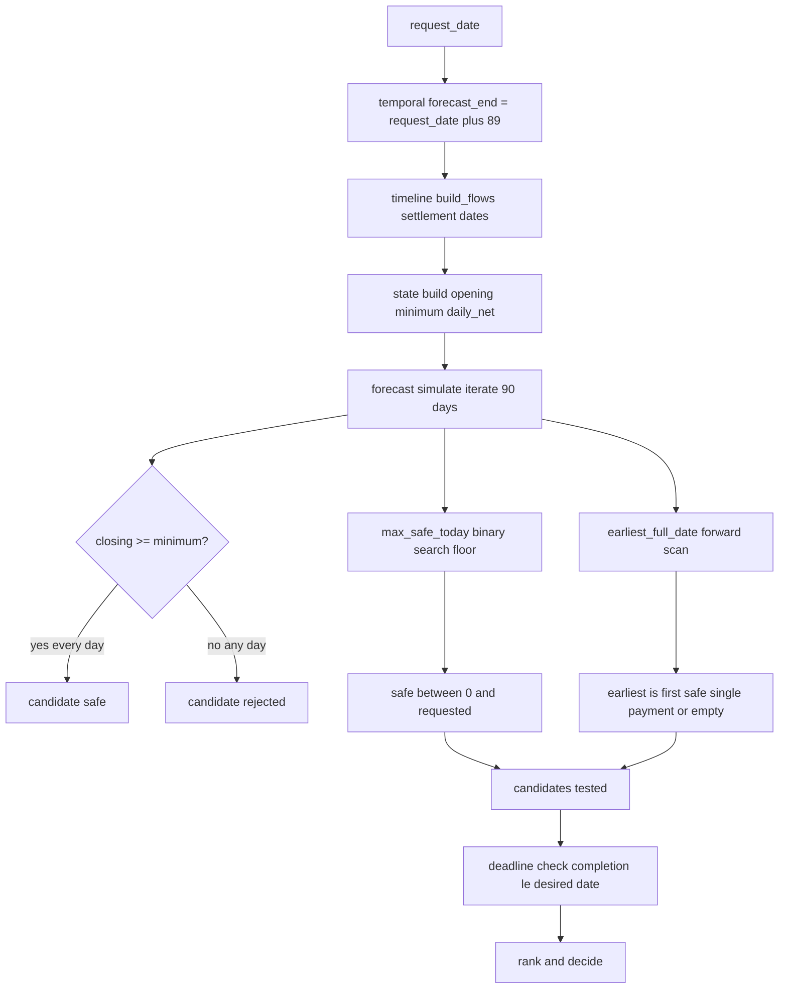
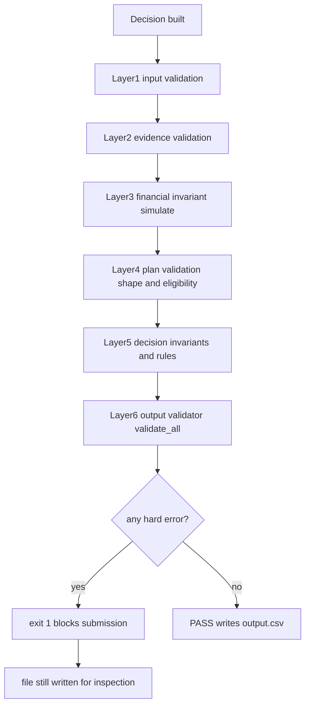

# Architecture

```text
REQUEST
  ↓
DATA RESOLVER (ingestion/ — joins only, stamps original_index)
  ↓
EVIDENCE RESOLVER (evidence/ — deterministic in E0; AI-gated E1+)
 ├── structured data (deterministic)
 ├── messages (regex baseline; targeted LLM for ambiguity only via adapter, E1+)
 └── images (only when needed, esp. blank amounts; extraction via adapter, E1+)
    ↓
CANONICAL FINANCIAL STATE (finance/state.py — deterministic)
  ↓
90-DAY FORECAST ENGINE (finance/forecast.py + timeline.py — deterministic)
  ↓
CANDIDATE PLAN GENERATOR (finance/payment_plans.py — deterministic)
  ↓
PLAN SAFETY VALIDATOR (decision/invariants.py — deterministic gate)
  ↓
PLAN RANKING / OPTIMIZER (finance/optimizer.py — fixed 6-rule order, deterministic)
  ↓
CANONICAL DECISION OBJECT (decision/decision.py — single source of truth)
  ↓
GROUNDED EXPLANATION (output/explanation.py — deterministic template over
validated facts in E0; LLM draft from validated facts only, E5+)
  ↓
OUTPUT VALIDATOR (output/validator.py + scripts/validate_output.py — deterministic block)
  ↓
output.csv (sorted by original_index)
```

### Diagram 1 — Main pipeline (code-verified, implementation terms)



## Deterministic vs AI vs validation

- **Deterministic:** ingestion, state, currency, timeline, forecast, plans, spending-changes,
  eligibility, ranking/tie-breaks, invariants, serializer, validator, harness.
- **AI-assisted (gated by ablation E1/E2/E5):** message semantics, image extraction,
  amendment/cancellation reading, explanation drafting — outputs are *proposed evidence*,
  validated before entering the financial engine.
- **Validation (blocks submission):** schema/identity/bounds/plan/evidence/consistency checks.

## Why this shape

Spec-first, correctness-over-sophistication: the score is decided by safe-amount accuracy,
valid plans, and constraint compliance — all exact computation. No multi-agent framework,
no dashboard/DB, no second provider until an ablation win is measured.

## Trust boundary

UNTRUSTED (evidence, never authority): `messages.csv` text, `images.csv` + PNG bytes,
any model output from `llm_adapter.propose_facts`, external env/config values.
TRUSTED AFTER VALIDATION: normalized `Evidence` that passed registry ownership +
conflict precedence; deterministic financial state/forecast/plans; the canonical
`Decision`; validator-approved rows. The rule engine never reads raw message text
(`message_interpreter` emits typed facts only), and the image path may only emit
`kind==amount` facts (`pipeline.py:_collect_evidence` drops all other kinds).

## Failure boundary

Every model/external-tool failure has an explicit safe policy (`llm_adapter.FAILURE_MATRIX`,
spec §9): timeout/429/5xx → bounded retry → empty fallback; invalid schema →
immediate drop; missing evidence → UNKNOWN marker; impossible plan → candidate
rejected → `not_recommended`; unexpected per-request exception → `_decide_safe`
fallback row; validator error → exit 1. Failures are logged to the Sec-33
`RequestTrace.failures` list plus the legacy `Trace`, never with secret values.

## Validation boundary (six layers, each fail-closed)

1. input validation (`ingestion/*`, `pipeline._validate_request_identity/_validate_fk_integrity`)
2. evidence validation (`evidence_registry.add`, `_validate_proposal`, conflict precedence)
3. financial invariant validation (`state.build` guards, `forecast.simulate` floor re-check)
4. plan validation (`payment_plans` shape gates, `eligibility`, `expand_schedule` exactness)
5. decision validation (`decision.__post_init__`, `invariants.check_earliest_consistency`, `rules.derive`)
6. output validation (`output/validator.validate_all`, `scripts/validate_output.py` gate)

### Diagram 2 — 90-day safety ledger (code-verified, temporal.forecast_end equals request_date plus 89)



### Diagram 5 — Validation layers and gate (code-verified, scripts validate_output exits 1)



## Rejected alternatives

- LLM financial reasoning (unverifiable arithmetic) → rejected.
- Generic agent/orchestration graph (cost + nondeterminism, no scoring gain) → rejected.
- Invented schedules or income (spec forbids) → rejected.
