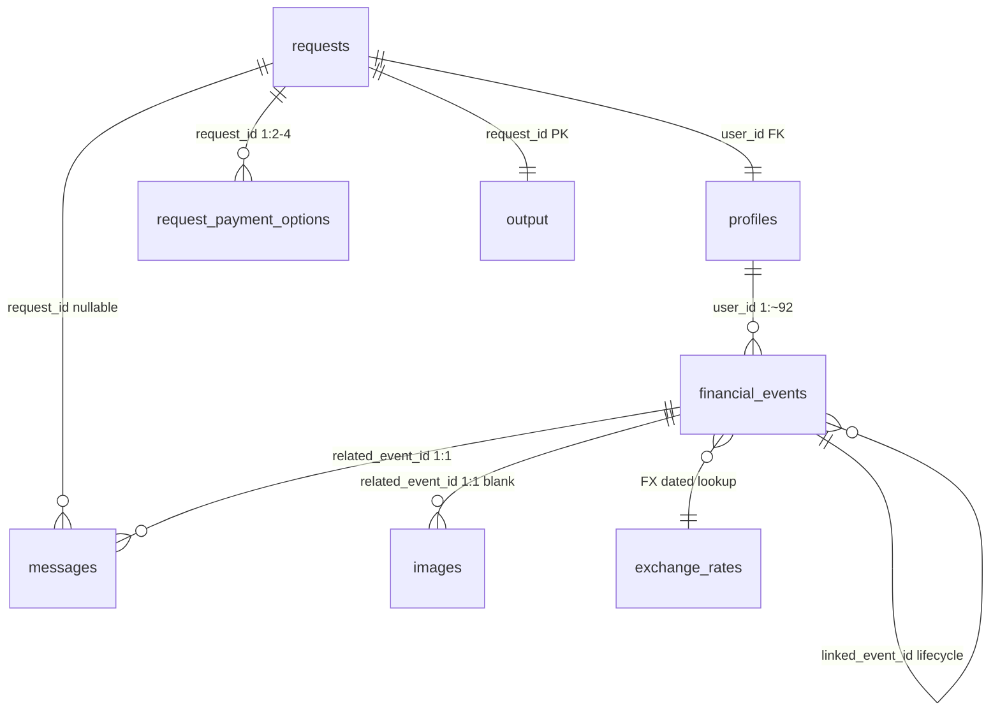

# Data Model — AffordAI

> **Version:** 1.2 · **Last updated:** 2026-09-13 · **Source:** `dataset/official/` inspected via `csv.DictReader` (see `evaluation/reports/data_inventory.md` + `join_integrity.md`)

## Table of Contents

- [Entities](#entities)
- [ER Diagram](#er-diagram)
- [Joins](#joins)
- [Canonical Context](#canonical-context-preserved-end-to-end)
- [Temporal Meaning](#temporal-meaning)
- [Nullability & Invariants](#nullability--invariants)

## Entities

- **requests** (`request_id` PK): `user_id FK`, `request_date`, `request_type`, `requested_amount`,
  `desired_completion_date`, `allows_partial_payment`, `request_text`.
- **profiles** (`user_id` PK): `home_currency`, `current_available_balance`, `minimum_balance_to_keep`,
  priorities, `expense_categories_to_protect`, `..._willing_to_reduce/_stop`,
  `payment_methods_user_will_consider`, `max_installment_months` (blank = no installments).
- **financial_events** (`event_id` PK): `user_id FK`, `event_type`, `description`, `category`,
  `direction (debit|credit)`, `amount` (nullable → image), `currency`, `event_date`,
  `settlement_date`, `status` (settled|pending|scheduled|failed|cancelled|unrealized… — confirm in inventory),
   `linked_event_id` (→ earlier event, same lifecycle; link alone ≠ cash-flow verdict),
   `flexibility (fixed|reducible|stoppable|reducible_or_stoppable)`,
   `minimum_allowed_amount` (set for reducible/reducible_or_stoppable only).
- **request_payment_options** (`payment_option_id` PK): `request_id FK`, schedule
  (`payment_amount × number_of_payments`, `first_payment_date`, `payment_frequency_days`),
  `financing_fee`, `total_payable_amount`.
- **exchange_rates**: (`rate_date`, `from_currency`, `to_currency`) → `rate`.
- **messages** (`message_id` PK): `user_id`, `request_id` (nullable), `related_event_id`
  (only when 1:1 to an event row), `sent_at`, `source_type`, `message_text` (multilingual).
- **images** (`image_id` PK): `user_id`, `request_id`, `related_event_id`; file
  `dataset/official/media/images/<image_id>.png`.
- **output** (`request_id` PK): 8 required columns (§spec 3).

## ER Diagram



## Joins

| Relationship | Cardinality | FK Check | Notes |
|---|---|---|---|
| `requests.user_id → profiles.user_id` | 1:1 | 250/250 | `profiles∖requests` = 25 sample-only users |
| `requests.request_id → payment_options.request_id` | 1:2–4 | 250/250 | avg 2.876; `790 = 719 eval +71 sample` |
| `requests.request_id → messages.request_id` | 1:n nullable | 116 eval distinct | 87 blank = user-level broadcast |
| `financial_events.user_id → profiles.user_id` | n:1 | 25342/25342 | 56–129 events/user |
| `financial_events.linked_event_id → financial_events.event_id` | lifecycle | 58 links, 0 orphans | refund/valuation chains, 0 fan-in |
| `messages/images.related_event_id → financial_events.event_id` | 1:1 nullable | 39 + 16, 0 orphans | strictly 1:0..1 per event |
| `exchange_rates.(rate_date,from,to)` | dated FX | 140 foreign → 0 missing | 5 directed pairs, latest-on-or-before A1 |

```text
requests.user_id → profiles.user_id (1:1 per request user)
requests.request_id → payment_options.request_id (1:2–4)
requests.request_id → messages.request_id (1:n, nullable) + users/messages by user_id
financial_events.event_id ↔ messages/images.related_event_id (1:n evidence)
financial_events.linked_event_id → financial_events.event_id (lifecycle chain)
FX: (settlement_date, currency → home_currency) → exchange_rates
```

## Canonical context (preserved end-to-end)

```python
RequestContext(original_index, request_id, user_id, request, profile,
               events, messages, images, payment_options, evidence)
```

## Temporal Meaning

| Field | Meaning | Used In |
|---|---|---|
| `event_date` | occurred/recorded | display / `linked_event_id` chain |
| `settlement_date` | cash movement | **forecast** (`timeline.build_flows`) |
| `request_date` | day-0 of 90-day window | `temporal.forecast_end = request_date + 89` |
| `first_payment_date` / `payment_frequency_days` | installment cash days | `payment_plans.expand_schedule` |
| `sent_at` | message precedence `ISO YYYY-MM-DDTHH:MM:SSZ` | `conflict_resolver.resolve` |
| `desired_completion_date` | deadline gate (inclusive) | `forecast.simulate` + `optimizer.rank_key` |
| `rate_date` | FX dated rate | `currency.RateTable` per A1 |

`settlement_date` is authoritative for cash flow; `event_date` is fallback only for 10 `unrealized` rows (then ignored per spec §4).

## Nullability & Invariants

| Field | Nullable | Meaning When Blank/Empty |
|---|---|---|
| `financial_events.amount` | ✅ 16/25342 | → `images.csv:related_event_id` → PNG; NEVER 0 (`money.parse_amount_safe` → `None`) |
| `messages.related_event_id` | ✅ 176/215 | no 1:1 event linkage; `request_id` still routes |
| `messages.request_id` | ✅ 87/215 | user-level broadcast (join via `user_id` + window) |
| `financial_profiles.max_installment_months` | ✅ 119/275 | user refuses installments (eligibility gate) |
| `output.earliest_date` | ✅ empty if never safe | ⇔ full never safe within 90-day window |
| `request_payment_options.payment_frequency_days` | ✅ 275/790 | single-payment option (`number_of_payments=1`) |
| `financial_events.settlement_date` | ✅ 10/25342 | `unrealized` valuations → fallback `event_date`, then ignored |
| `financial_events.minimum_allowed_amount` | ✅ 22435/25342 | only for `reducible`/`reducible_or_stoppable` |

**Invariants:** all PKs unique (see `join_integrity.md §1`); `minimum_balance_to_keep ≤ current_available_balance` (0 violations); `desired_completion_date ≥ request_date` (0 inverted); blank request amounts = 0 (blanks are at *event* level only).
