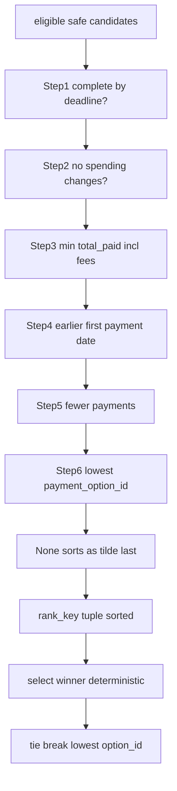

# Decision Matrix — Input → Output Rules

> **Version:** 1.2 · **Last updated:** 2026-09-13 · **Authority:** `docs/specification.md` §§3-5 + `src/affordai/decision/` + `src/affordai/finance/optimizer.py`
> Companion to `specification.md`. No code may contradict this file.

## Table of Contents

- [A. Status × Method Allowed Pairs](#a-status--method-allowed-pairs)
- [B. Method Eligibility](#b-method-eligibility-before-ranking)
- [C. 90-Day Gate](#c-90-day-gate-every-candidate)
- [D. Ranking](#d-ranking-first-match-wins)
- [E. Spending Changes](#e-spending-changes)
- [F. Conflicts](#f-conflicts)
- [G. Amounts/Dates](#g-amountsdates)

## A. Status × method allowed pairs

| status | allowed methods | notes |
|---|---|---|
| `affordable_now` | `full_payment` | full safe today + user accepts full; `earliest == request_date`; plan = `request_date:requested` |
| `affordable_with_plan` | `partial_payment` (strict 5-conds), `installments` (exact option match), `full_payment` iff spending changes make today safe | full completed via plan/changes |
| `affordable_later` | `wait` | full safe later ≤ forecast; plan = `earliest:requested` (single future payment); `earliest > request_date` |
| `not_affordable` | `not_recommended` | plan `none`, changes `none`; `earliest` empty OR later capacity date (see note); `safe` may be >0 but < requested |

`partial_payment ⇒ affordable_with_plan` (never with other statuses).
`earliest` measures capacity independently of preferences/deadline (Tier 1):
it may be set even for `not_affordable` (capacity exists later, e.g. past the
deadline, but no eligible plan completes safely) or equal `request_date` under
installments. Empty `earliest` ⇔ full payment never safe within forecast.
`wait` plan is a single future full payment on `earliest`, NOT an installment schedule.

## B. Method eligibility (before ranking)

- `full/partial/installments` require membership in `payment_methods_user_will_consider`.
- `installments` additionally require `max_installment_months` non-blank and option term compatible;
  option may still be rejected on preference/term conflict.
- Partial additionally requires `allows_partial_payment == true`, `0 < safe < requested`,
  `earliest <= desired_completion_date`, exact 2-payment shape summing to requested.
- `wait` requires future-safe full + user accepts `full_payment`.
- Else `not_recommended` (`none`, changes `none` unless changes alone can't complete → still `none`).

## C. 90-day gate (every candidate)

Simulate with essentials + recurring + confirmed futures + candidate payments.
REJECT candidate if any day `closing < minimum`, or completion `> desired_completion_date`
(except `not_recommended`), or FX/date arithmetic unvalidated.

## D. Ranking (first match wins)

1. completes by deadline 2. no spending changes 3. min total paid (incl. fees)
4. earlier first-payment date 5. fewer payments 6. lowest `payment_option_id`.

### Diagram 4 — Ranking 6-tuple optimizer rank_key (code-verified, finance optimizer)

Eligible safe candidates are ranked by `optimizer.rank_key(candidate, deadline)` 6-tuple.

## E. Spending changes

Only flexible recurring events in willing categories; ≤3; no same-event stop+reduce;
each change re-simulated (must flip an unsafe plan safe or be omitted).

## F. Conflicts

cancel/settle/amend > newer same-source > settled > safer. LLM never reorders this.

## G. Amounts/Dates

| Rule | Value | Verified In |
|---|---|---|
| `0 ≤ safe ≤ requested` | fail-closed clamp | `forecast.max_safe_today` post-conditions |
| `safe` BEFORE optional changes | spending changes must flip unsafe→safe | `pipeline.py:decide_context` order |
| `earliest` WITHOUT optional changes | independent of preferences/deadline | `forecast.earliest_full_date` single-state sig |
| Quantization | 2dp `ROUND_FLOOR` for all 5 currencies | `finance/money.py:quantize` (IDR `15952906.67` observed) |
| Date format | `YYYY-MM-DD` strict | `output/serializer.py:format_date` |

## H. Worked Decision Table (LOCAL MEASUREMENT, 2026-09-13)

| Request | Status | Method | Safe | Earliest | Plan | Reason |
|---|---|---|---|---|---|---|
| `request_26` | `affordable_now` | `full_payment` | 15656000 | 2025-08-03 | `2025-08-03:15656000` | full safe today |
| `request_30` | `affordable_with_plan` | `installments` | 738.16 | (empty) | `2026-04-06:268.74|...` | installments exact match, earliest empty = single-payment never safe |
| `request_36` | `affordable_later` | `wait` | 789.44 | 2026-08-15 | `2026-08-15:3954` | future salary makes full safe |
| `request_28` | `not_affordable` | `not_recommended` | 0 | (empty) | `none` | no safe candidate |
| *synthetic* | `affordable_with_plan` | `partial_payment` | 1500 | 2026-02-10 | `REQ:1500|EAR:2500` | 5 gates + 2-leg exact shape |

> See `docs/specification.md §6.1` for full traces and `tests/regression/test_sections_15_21.py` for synthetic proofs.
