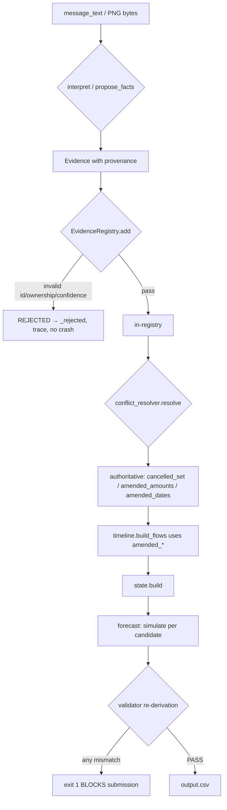

# Evidence & Traceability — AffordAI

> **Version:** 1.0 · **Last updated:** 2026-09-14 · **Principle:** Every fact has provenance; unsupported evidence never enters decisions.
> Mirrors `src/affordai/evidence/evidence_registry.py` + `pipeline.py:_collect_evidence` — code authoritative.

## Table of Contents

- [Traceability Chain](#traceability-chain)
- [Evidence Provenance Schema](#evidence-provenance-schema)
- [Evidence Sources](#evidence-sources)
- [Extraction → Validation Flow](#extraction--validation-flow)
- [Trace Artifacts](#trace-artifacts)
- [Grounded Explanation](#grounded-explanation)
- [Validation Gates](#validation-gates)
- [Example Traces](#example-traces)

## Traceability Chain

```
RAW EVIDENCE (CSV row / PNG bytes / message_text)
  ↓  extraction
EXTRACTED FACT (Evidence with provenance)
  ↓  EvidenceRegistry.add (ownership + allowlist + confidence [0,1])
VALIDATED FACT (in-registry, confidence ≥ threshold)
  ↓  conflict_resolver.resolve (4-rule precedence + sent_at + method rank)
AUTHORITATIVE FACT (cancelled_set / amended_amounts / amended_dates)
  ↓  timeline.build_flows + state.build
FINANCIAL STATE (opening, minimum, daily_net per settlement_date, FX home)
  ↓  forecast.simulate + max_safe_today + earliest_full_date
CANDIDATES + SAFETY PROOF (simulate per plan)
  ↓  eligibility.filter + optimizer.rank_key
DECISION (canonical Decision, 8 fields + evidence tuple)
  ↓  explanation.build (facts subset, validate)
EXPLANATION (WHY+CONSTRAINT+PLAN+TIMING+EVIDENCE)
  ↓  serializer.decisions_to_rows + validator.validate_all
OUTPUT.CSV (250 rows, sorted original_index, header byte-identical)
```

## Evidence Provenance Schema

`Evidence` in `src/affordai/evidence/evidence_registry.py:15-48`:

| Field | Type | Purpose | Example |
|---|---|---|---|
| `kind` | enum 8 | `cancel \| settle \| confirm \| delay \| amend_amount \| amend_date \| preference \| amount` | `amend_amount` |
| `source_type` | str | `message \| image \| structured` | `message` |
| `source_id` | str | `message_id` / `image_id` | `message_05` |
| `request_id` | str | Owning request | `request_26` |
| `user_id` | str | Owning user | `user_26` |
| `event_id` | str? | Linked event | `event_3051` |
| `message_id` | str? | Source message | `message_26` |
| `image_id` | str? | Source image | `image_06` |
| `raw_value` | str | Verbatim source snippet | `"Please update amount to 2500"` |
| `normalized_value` | str/Decimal/date | Typed value | `Decimal("2500")` |
| `confidence` | float [0,1] | 1.0 deterministic, ≥0.80 LLM | `1.0` |
| `method` | str | `deterministic \| llm` | `deterministic` |
| `extraction_method` | str | `regex \| llm_adapter \| image_linkage` | `regex` |
| `sent_at` | datetime? | Message timestamp for precedence | `2026-06-22T01:00:00Z` |

`.provenance()` emits redacted dict (no prompts/keys). `EvidenceRegistry.add` enforces: source_type/kind/method allowlist, request/user ownership, event/message/image id existence, confidence range, raw/normalized preservation. Rejections → `_rejected` with code.

## Evidence Sources

| Source | Grain | Typed Kinds | Provenance | Trust |
|---|---|---|---|---|
| **structured data** (CSV loaders) | per row | none (trusted after load) | loader + `original_index` | **Trusted** post-load |
| **messages** (`messages.csv` 215 rows) | per message | `cancel/settle/confirm/delay/amend_amount/amend_date/preference` | `interpret(message)` + `message_id/sent_at` + `EvidenceRegistry` | **Untrusted** → validated |
| **images** (`images.csv` 16 ↔ PNGs 16) | per blank event | `amount` only (pipeline drops other kinds) | `resolve_images_for_event` + `image_id/file_exists` | **Untrusted** → validated |
| **AI extraction** (`llm_adapter.propose_facts`) | per request / per blank event | same 8 kinds, `kind==amount` forced for image path | `source_type=llm`, confidence ≥0.80, `minimize_*_context`, `check_batch_safe` | **Untrusted** → validated-or-dropped, `no-backend` fallback |
| **deterministic computation** (`finance/*`, `decision/*`) | per candidate | amounts/dates/ranking/Decision | `simulate` + `validator` re-derivation | **Authoritative** |

65 determinism: `finance/*`, `decision/*`, `output/validator` contain **zero** `propose_facts`/`openai`/`date.today` imports (proven `test_no_llm_or_clock_in_deterministic_core`).

## Extraction → Validation Flow



**Key gates:**

- `interpret` emits typed facts only; rule engine never reads raw `message_text` (injection → typed fact → floor re-simulation).
- Image path: non-`amount` kinds dropped (`pipeline.py:_collect_evidence kind==amount` filter) — “see receipt #123” never becomes a fact.
- `parse_amount>0` gate + `event_id` gate drops payroll refs (`EMP-0001`) and zero/negative hallucinations.
- `conflict_resolver` 3-pass stable sort: `explicit cancel/settle/amend (0/1/2)` → `newer same-source sent_at desc` → `settled` → `safer` + `deterministic > LLM` + lexical source_id.
- `simulate()` floor gate + independent `validator` re-derivation — any fabricated safety is caught twice.
- Per-request fallback `_decide_safe` on unexpected error → `not_affordable/none/0` preserving derivable `safe/earliest`; batch never crashes.

## Trace Artifacts

| Artifact | Location | Contains | When |
|---|---|---|---|
| `RequestTrace` (10 sections) | `observability/request_trace.py:RequestTrace` in-memory via `pipeline.run(request_traces=store)` | `trace_id, original_row_index, facts, flows_summary, safe, earliest, candidates, rejected_plans with reason_code, selected, status` | Every `build_output.py` run when store supplied |
| `Trace` (legacy) | `observability/tracing.py:Trace` | `request_id + message, no secrets, deterministic ids` | Always |
| `trace_request.py` JSON | stdout or `evaluation/local/trace_<req>.json` | Full 10-section trace for one request | `python scripts/trace_request.py --request request_30 --dataset dataset/official` |
| `output.csv` row | `output/serializer.py:decisions_to_rows` | 8 fields + `decision_explanation` derived from validated `Decision` | Every build |
| `validation report` | `scripts/validate_output.py` | `list[ValidationError]` with `OUTPUT-STRUCT/ID/NUM/ENUM/PLAN/SPEND/EVIDENCE/CONSISTENCY` | Every validate |

`RequestTrace.failures` + legacy `Trace` log every `fallback_reason` / `no-backend` / `rejected` code — never with secret values (`security/redact.py`).

## Grounded Explanation

`output/explanation.py:build` template `WHY+CONSTRAINT+PLAN+TIMING+EVIDENCE` over **validated `Decision` facts only**:

| Segment | Derived From | Validation |
|---|---|---|
| **WHY** | `Decision.affordability_status + recommended_payment_method` | `explanation.validate` checks status↔method |
| **CONSTRAINT** | `state.minimum`, `safe`, `requested` | checks `0≤safe≤requested` + amounts match |
| **PLAN** | `Decision.payment_plan` + `total_paid incl fees` | checks leg totals re-derived |
| **TIMING** | `earliest`, `request_date`, `desired_completion_date` | checks chronological + deadline |
| **EVIDENCE** | `evidence` tuple + `source_id` | checks `source_id` ∈ `evidence` tuple, no invented ids |

`validate(text, decision)` rejects invented amounts/dates/evidence/contradiction; `build_fallback` deterministic on failure. All 250 rows pass (`test_sections_22_26:24.x` 6 tests; `ablation.py:instrument_e5_explanations` 250/250).

## Validation Gates

6 layers (`docs/architecture.md` + `output/validator.py`), each fail-closed:

| Layer | Module | Checks | Code |
|---|---|---|---|
| 1. Input | `ingestion/*`, `pipeline:_validate_*` | PK unique, FK exists, header exact, type bounds | `162`, `393-557` |
| 2. Evidence | `evidence_registry.add`, `_validate_proposal` | Allowlist, ownership, confidence [0,1], no NaN/Infinity | `76-130` |
| 3. Financial invariant | `forecast.simulate` | `closing ≥ minimum` every day, no double-count | `simulate` |
| 4. Plan | `payment_plans`, `eligibility`, `expand_schedule` | Chronology, partial 2-leg sum, installment exact, deadline, spending ≤3 flexible | `validator.validate_plans` |
| 5. Decision | `decision/__post_init__`, `invariants`, `rules.derive` | Bounds, enums, status↔method↔plan↔earliest↔changes↔explanation | `validator.validate_consistency` |
| 6. Output | `output/validator.validate_all`, `scripts/validate_output.py` | Structural 8 cols, row order, IDs unique+ordered, re-simulation floor | exit 1 blocks |

Mutation: reordered/invented/out-of-bounds/bogus — **13/13 REJECTED** (`test_sections_22_26:26.x`).

## Example Traces

**request_26 — affordable_now/full_payment (deterministic, no message facts):**

```
request_26 → interpret 0 facts → state opening covers 15656000 + minimum
           → max_safe 15656000 == requested, earliest 2025-08-03
           → candidates: full 2025-08-03:15656000 PASS simulate, 3× deadline-exceeded rejected
           → eligibility PASS (accepts full) → rank → Decision affordable_now/full_payment
           → explanation "Requested 15656000 IDR on 2025-08-03: amount safe today … plan 2025-08-03:15656000"
           → validator PASS
```

**request_33 — image UNKNOWN (blank event_3051 → image_06):**

```
event_3051 amount None → resolve_images_for_event finds image_06 file_exists true
         → propose_facts image_amount_extract → no-backend, 0 facts, estimated-token record
         → amount_unknown_evidence confidence 0 (never 0) → timeline excludes cash flow
         → forecast unsafe → not_affordable/not_recommended plan none → validator PASS
```

**Synthetic cancel vs amend (conflict):**

```
amend_amount 50 + cancel e-2 → resolve cancel rank 0 beats amend rank 2 (explicit > newer)
                              → cancelled_set ∋ e-2 → build_flows drops event → re-simulate
```

Full traces: `python scripts/trace_request.py --request request_30 --dataset dataset/official` (installments) etc. See `docs/interview-notes.md §38.2` for 7 walkthroughs with real row values.

Cross-doc: `docs/specification.md §6`, `docs/architecture.md` (trust boundary), `docs/implementation-status.md` (evidence row 7-11), `tests/regression/REGRESSIONS.md` (R1-R6).
